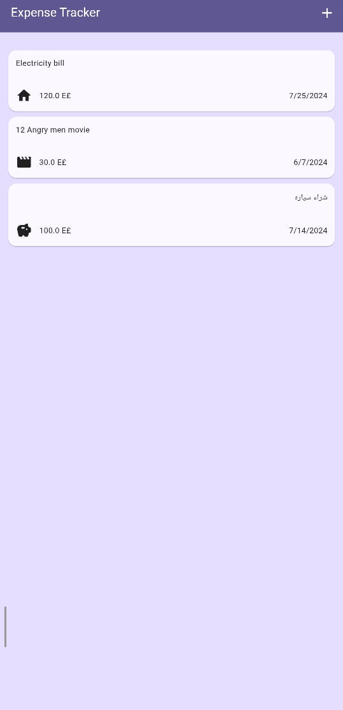
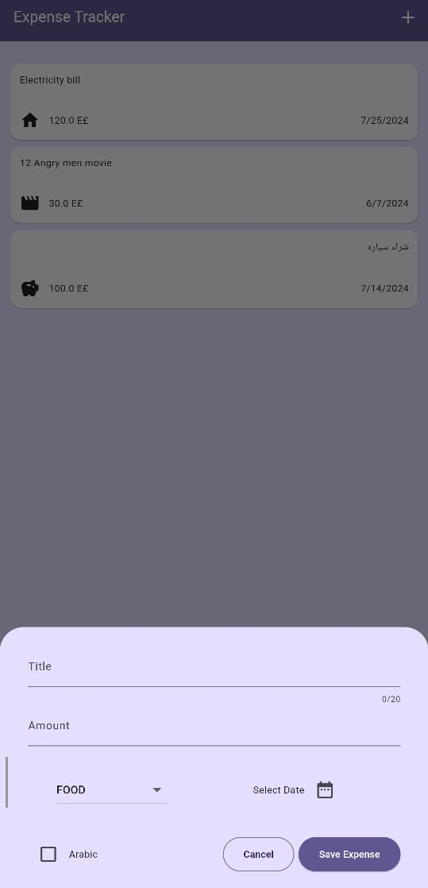

# Expense-Tracker
This is a Flutter app designed to help you track your expenses efficiently. With this app, you can add, view, and manage your expenses with ease.

## Features
- Add Expense: Add your daily expenses with details such as amount, category, and date.
- View Expenses: View all your expenses in a list format.
- Delete Expense: Remove expenses with a swipe and undo if necessary.
- Dark and Light Mode: Automatically adjusts based on system settings.
- Responsive Design: Adapts to screen rotations and various screen sizes.

## Screenshots

## Usage

1. **Add a New Expense:**
    - Click on the Plus icon button.
    - Fill in the details such as amount, category, and date.
    - To add an Arabic title, check the corresponding checkbox.
    - If you enter a wrong value or do not complete the input, an error alert will appear.
    - Click "Save" to view your expense on the Home page.

2. **View All Expenses:**

    - The Home screen lists all expenses.
    - If there are no expenses, the placeholder text "Enter some expenses" will be displayed.
    - Each expense card includes:
      -Title
      - Date (formatted as Y/M/D)
      - Category Icon
      - Amount
    - Arabic titles will appear on the right side of the card if enabled.

3. **Delete an Expense:**

    - Swipe from right to left on the expense you wish to delete.
    - Click the "Undo" button that appears to return the expense to its original position.

4. **Dark and Light Mode:**

    - The app automatically adjusts its colors based on the system's dark or light mode settings.

5. **Responsive Design:**

    - The app supports screen rotation and adapts to various screen sizes for a consistent user experience.
