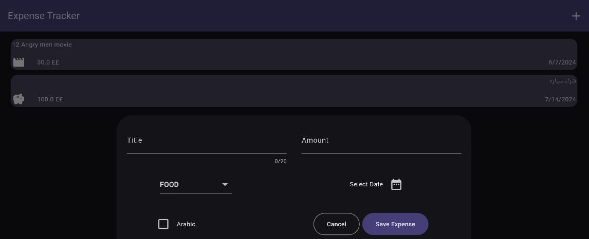

# Expense-Tracker
This is a Flutter app designed to help you track your expenses efficiently. With this app, you can add, view, and manage your expenses with ease.

## Features
- Add Expense: Add your daily expenses with details such as amount, category, and date.
- View Expenses: View all your expenses in a list format.
- Delete Expense: Remove expenses with a swipe and undo if necessary.
- Shared Preferences: Save expenses using Shared Preferences for persistent storage.
- Dark and Light Mode: Automatically adjusts based on system settings.
- Responsive Design: Adapts to screen rotations and various screen sizes.

## Screenshots

  
  

*Home Screen displaying expenses, including title, amount, type, and date. \n Add Page displaying input fields for title, amount, category, and date.*

*Orientation screenshot showcasing responsiveness.*

